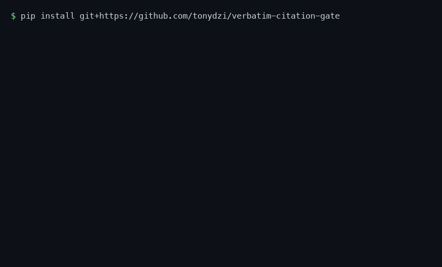

# verbatim-citation-gate

[](https://github.com/tonydzi/verbatim-citation-gate/actions/workflows/tests.yml)
[](https://github.com/tonydzi/verbatim-citation-gate/blob/master/pyproject.toml)
[](LICENSE)
[](https://tonydzi.github.io/verbatim-citation-gate/)

**Catch fabricated RAG citations before they reach the user.** A two-stage, framework-agnostic auditor for quote-style citations.
The deterministic half is `src/verbatim_citation_gate/gate.py`: zero dependencies, zero tokens.
The model half is `src/verbatim_citation_gate/judge.py`, and plugs into whatever LLM your pipeline already speaks.



## Quickstart — 30 seconds, no API key

```bash
pip install "git+https://github.com/tonydzi/verbatim-citation-gate"
```

```python
from verbatim_citation_gate import quote_gate

docs = {"veltranib-rct": "... Body weight was unchanged in both arms."}

quote_gate("Body weight was unchanged in both arms.", "veltranib-rct", docs)  # 'found'
quote_gate("Veltranib produced dramatic weight loss.", "veltranib-rct", docs)  # 'not_found'
```

That is stage 1, and it is the whole offline half: no key, no network, no tokens.
The run in the animation above is [`examples/demo.py`](examples/demo.py) — `python examples/demo.py`
reproduces it, model calls counted by the demo itself.
Stage 2 (the judge) needs a model and is one argument away — see [Use](#use) below.

📖 **Docs: <https://tonydzi.github.io/verbatim-citation-gate/>** — the two stages, the API, the verdicts, and every known limit with its issue.

RAG systems love to cite. The problem is *how they fail* — a quote that reads as authoritative and word-for-word can still be one of three things, each with its own case in `tests/test_gate.py`:

- **fabricated** — a plausible sentence that appears in no source (`test_fabrication_is_not_found`),
- a **frankenquote** — every word is real, but the sentence was stitched together and never actually written (`test_frankenquote_is_not_found`), or
- **misattributed** — a real quote lifted from a *different* document (`test_misattributed_real_quote_from_wrong_doc`).

A judge model, asked "does this quote support this claim?", waves all three through: they read as fluent and supportive.
The fix is to ask the cheaper, prior question first, deterministically — that is `src/verbatim_citation_gate/gate.py`.

## The two stages

```
                 ┌─────────────────────────┐
 claim + quote → │ 1. verbatim gate (free)  │ → not_found / misattributed   (rejected, 0 tokens)
   + doc id      └─────────────┬───────────┘
                               │ found
                               ▼
                 ┌─────────────────────────┐
                 │ 2. skeptical judge (LLM) │ → supports / partial / unrelated / contradicts
                 └─────────────────────────┘
```

**Stage 1 — the verbatim gate**, all of it in `src/verbatim_citation_gate/gate.py`.
Pure `re` + substring matching over a normalized form: case, smart quotes, dashes and whitespace folded, numbers and `%` preserved (`test_normalize_preserves_numbers_and_percent` in `tests/test_gate.py`).
It cannot be sweet-talked, and every fabrication it rejects costs zero model calls — proven by `test_audit_fabrication_never_calls_judge` in `tests/test_gate.py`.
Frankenquotes fail because the match is contiguous, not bag-of-words, and a real quote from the wrong document is surfaced as `misattributed` rather than collapsed into `not_found` — the two need different fixes upstream (`src/verbatim_citation_gate/gate.py`).

**Stage 2 — the skeptical judge**, all of it in `src/verbatim_citation_gate/judge.py`.
For quotes that *do* exist, a burden-of-proof prompt decides whether the passage actually establishes the claim. All three rules below live in that file's prompt:

1. **Default-refute** (`judge.py`) — the verdict starts at *unsupported*; the quote must
   earn `supports`, and ties break against the claim.
2. **Outside knowledge is inadmissible** (`judge.py`) — a claim can be true in the world
   and still unsupported by *this* source.
3. **Full-strength support** (`judge.py`) — same population, direction, magnitude and
   certainty, or the verdict caps at `partial`
   (subgroup→everyone, correlation→causation, "may"→"does").

If the judge's output does not parse it **fails closed** (`src/verbatim_citation_gate/judge.py`):
an unverifiable citation never counts as support.

## Install

Not on PyPI yet — install from the repository:

```bash
pip install "git+https://github.com/tonydzi/verbatim-citation-gate"

# from a clone, with the test extra:
pip install -e ".[test]" && pytest -q
```

<!-- pypi-install-marker -->

Pure stdlib: the gate pulls in nothing, and the judge takes whatever `llm_call`
you already have.

## Use

```python
from verbatim_citation_gate import audit_citation

docs = {"veltranib-rct": "... Body weight was unchanged in both arms."}

# Stage 1 only — no model, no key, fully offline:
audit_citation("Body weight did not change.", "veltranib-rct",
               "Body weight was unchanged in both arms.", docs)   # -> "found"

# Both stages — supply any model as llm_call(system, user) -> str:
def llm_call(system, user):
    return client.messages.create(              # Anthropic shown; any vendor works
        model="claude-haiku-4-5", system=system, max_tokens=1024,
        messages=[{"role": "user", "content": user}],
    ).content[0].text

audit_citation("Body weight did not change.", "veltranib-rct",
               "Body weight was unchanged in both arms.", docs, llm_call=llm_call)
# -> "supports" | "partial" | "unrelated" | "contradicts" | "not_found" | "misattributed"
```

`llm_call` is deliberately the smallest possible contract — `(system, user) → text`
— so the judge wires to Claude, GPT, Gemini, Mistral, Cohere, or a local Qwen
without adapters. OpenAI, Cohere, and other one-liners are in
[`examples/quickstart.py`](https://github.com/tonydzi/verbatim-citation-gate/blob/main/examples/quickstart.py).

## Why the gate goes first

The number you page on for a citation auditor is **recall of unfaithful
citations** — the fraction of bad citations you actually catch. The gate lifts
that recall for free on the three failure modes a judge is *worst* at
(fabricated, franken, misattributed), because those are exactly the ones that
look supportive. What reaches the model is only the genuinely ambiguous case:
a real quote whose *sufficiency* is a judgment call.

## Scope

The gate presumes **quote-style** citations. If your pipeline cites by document
id or character offsets, resolve the span to its source text first, then gate
that text. Contributions wiring this into specific frameworks (Haystack,
LlamaIndex, LangChain, Cohere, Qwen-Agent, …) are welcome.

## Roadmap

**Now — [v0.1.0](https://github.com/tonydzi/verbatim-citation-gate/releases/tag/v0.1.0).**
The deterministic gate (`gate.py`) and the burden-of-proof judge (`judge.py`), 24 tests green,
install from git. Known limits are open issues, not footnotes — read them before you rely on it,
especially [#1](https://github.com/tonydzi/verbatim-citation-gate/issues/1).

**Next**, in the order we would take them:

| What | Why it matters | Issue |
|---|---|---|
| Minimum-evidence rule | a one-word quote currently returns `found` | [#4](https://github.com/tonydzi/verbatim-citation-gate/issues/4) |
| Citations by doc id / offset | the gate presumes quote-style citations | [#9](https://github.com/tonydzi/verbatim-citation-gate/issues/9) |
| PyPI package | so `pip install verbatim-citation-gate` is real | [#8](https://github.com/tonydzi/verbatim-citation-gate/issues/8) |

**Shipped from this table** — all three fixed by outside contributor [Guan Tong](https://github.com/happykawayigt),
who claimed them off the issue list and had the first PR open within the hour: Unicode-aware normalization
([#1](https://github.com/tonydzi/verbatim-citation-gate/issues/1) — before it, the gate's
core promise was silently off in every non-Latin script), corpus normalization cached
([#2](https://github.com/tonydzi/verbatim-citation-gate/issues/2)), and the `py.typed` marker
([#3](https://github.com/tonydzi/verbatim-citation-gate/issues/3)).

Every noticeable change ships as a new release, so the
[release feed](https://github.com/tonydzi/verbatim-citation-gate/releases)
is the honest record of how far along this is — not the commit graph.

## What "working" means here — the metrics we actually track

Stars are free and prove nothing. From 2026-08 this project is measured on three
numbers, reviewed monthly, target horizon 4–8 months:

1. **Weekly unique clones** — people pulling the code, not applauding it.
2. **Independent consumers** — repos or teams that would have to replace this
   gate if it disappeared. This is the only number that really matters.
3. **Repeat outside contributors** — engineers who came back a second time.
   First one already exists; that fact is *why* this repo became the lab's flagship.

## AI contributors

This project is built by a human + AI team, and the git log says so: Claude
writes most of the code, Codex and Grok review it, Gemini feeds the research.
Each is credited on a commit **only if its output changed that commit's
content** — no decorative credits. Lab-wide policy, one source for every repo:
[AI-CONTRIBUTORS.md](https://github.com/tonydzi/.github/blob/main/AI-CONTRIBUTORS.md).

## License

MIT © Palo Alto AI Research Lab

<!-- CONTACT-FOOTER -->
## About & contact

Built and battle-tested at **Palo Alto AI Research Lab** — a fleet of Claude Code machines
running 24/7 as a second brain and synthetic cofounder. This gate was extracted after it
survived production, not written as a demo.

Questions, war stories, or you want to run this on your own fleet:

- 👤 Author: **Anton Dziatkovskii** — Telegram [@tonydzi](https://t.me/tonydzi) · WhatsApp [+1 341 222 9178](https://wa.me/13412229178) · X [@Tony_Stef_](https://x.com/Tony_Stef_)
- 📣 Channels: [@ClawRus](https://t.me/ClawRus) (RU) · [@ClawEng](https://t.me/ClawEng) (EN)
- 🌐 [palo-alto.ai](https://palo-alto.ai) · [Palo Alto AI Research Lab](https://github.com/tonydzi)
- 🧪 **Engineers: want to test-drive this setup?** Message me — I hand out free starter seeds to engineers who test and report back.

## Contributors welcome — and there is a queue

The queue is visible: **[verbatim-citation-gate — roadmap](https://github.com/users/tonydzi/projects/1)** — Now (an open PR exists), Next (scoped, free to take), Later (deferred, with the reason on the card), Shipped — and Shipped now starts with [v0.1.0](https://github.com/tonydzi/verbatim-citation-gate/releases/tag/v0.1.0).

Issues labelled [`accepted`](https://github.com/tonydzi/verbatim-citation-gate/issues?q=is%3Aissue+is%3Aopen+label%3Aaccepted)
are scoped, free to take, and nobody is on them. Comment **"claiming this"** — no permission needed —
and it is yours for 7 days. New here? Start with
[`good first issue`](https://github.com/tonydzi/verbatim-citation-gate/issues?q=is%3Aissue+is%3Aopen+label%3A%22good+first+issue%22).

**You keep the copyright to your code.** No CLA, no assignment, ever — your contribution goes in
under this repo's existing license, the same terms as ours. We answer every issue and PR within
48 hours, including "no, and here is why"; our silence is our bug, so ping the thread.

Full deal: [CONTRIBUTING.md](https://github.com/tonydzi/.github/blob/main/CONTRIBUTING.md)

---

<!--ecosystem-map:start-->

## 🧩 One piece of a working system

This repository is one piece lifted out of a live operation: one non-technical founder, an AI
cofounder, and a fleet of machines that reach consensus with each other and wake the human only
for money or the irreversible. It was extracted after it survived production, not written as a
demo — and it runs on its own: nothing here phones home to the rest.

**See how the whole thing fits together → [SYSTEM.md](https://github.com/tonydzi/tonydzi/blob/main/SYSTEM.md)**

Its closest neighbours in the **gates** layer: [`break-it-first`](https://github.com/tonydzi/break-it-first) · [`verdict-contract`](https://github.com/tonydzi/verdict-contract) · [`claim-check`](https://github.com/tonydzi/claim-check)

<!--ecosystem-map:end-->
